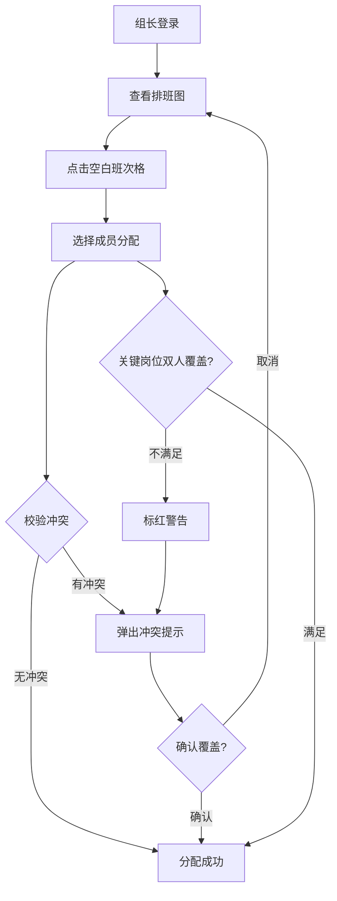

## 1. 产品概述

保障小组排班图系统用于管理保障团队的值班排班，解决排班冲突检测、关键岗位双人覆盖校验等核心问题。目标用户为保障组长、组员和值班经理，不同角色看到的入口与操作权限有差异。

- 解决纸质/Excel 排班易冲突、关键岗位漏排的痛点
- 实时校验 + 即时反馈，降低值班空窗风险

## 2. 核心功能

### 2.1 用户角色

| 角色 | 登录方式 | 核心权限 |
|------|----------|----------|
| 保障组长 | 账号密码 | 查看排班图、编辑排班、审批请假、查看成员详情、查看冲突提示 |
| 组员 | 账号密码 | 查看自己排班、提交请假申请、查看成员详情 |
| 值班经理 | 账号密码 | 查看全部排班图、查看冲突与覆盖报告、导出排班表 |

### 2.2 功能模块

1. **登录页**：角色选择 + 账号登录，不同角色进入不同首页
2. **排班图主页**：以周/日为维度的排班网格，展示班次、人员、岗位
3. **成员详情面板**：侧边抽屉展示成员信息、排班历史、请假状态
4. **排班编辑（组长专属）**：拖拽/点击分配成员到班次
5. **请假管理**：组员提交请假、组长审批
6. **冲突校验面板**：关键岗位双人覆盖检查、请假冲突检测

### 2.3 页面详情

| 页面名称 | 模块名称 | 功能描述 |
|----------|----------|----------|
| 登录页 | 角色选择 | 三种角色切换登录，展示不同欢迎语 |
| 排班图主页 | 排班网格 | 横轴日期、纵轴岗位，格子内显示值班人员 |
| 排班图主页 | 冲突提示条 | 顶部横幅，实时展示当前冲突数量与详情入口 |
| 排班图主页 | 班次编辑弹窗 | 点击空白格子弹出人员选择器，分配到班次 |
| 成员详情面板 | 成员信息卡 | 头像、姓名、角色、技能标签、请假状态 |
| 成员详情面板 | 排班历史 | 近两周该成员的排班记录列表 |
| 冲突校验面板 | 双人覆盖校验 | 关键岗位列表，标记覆盖不足的时段 |
| 冲突校验面板 | 请假冲突 | 请假成员仍被排班的时段列表，支持一键移除 |
| 请假管理 | 请假申请 | 组员选择日期提交请假 |
| 请假管理 | 请假审批 | 组长查看待审批列表，通过/驳回 |

## 3. 核心流程

**主链路 — 组长排班流程：** 组长登录 → 查看排班图 → 点击空白班次格 → 选择成员 → 系统自动校验冲突 → 若冲突则弹出提示 → 确认/取消

**关键岗位双人覆盖校验：** 排班变更时自动触发 → 遍历所有关键岗位 → 检查每个时段是否至少2人 → 不足则标红并在冲突面板显示

**请假冲突检测：** 成员请假审批通过后 → 扫描该成员已排班次 → 标记冲突 → 通知组长重新排班

## 4. 用户界面设计

### 4.1 设计风格

- 主色调：深蓝灰 (#1e293b) 背景 + 琥珀色 (#f59e0b) 强调色 + 翠绿 (#10b981) 成功色 + 玫红 (#f43f5e) 冲突色
- 按钮风格：圆角微阴影，hover 时微微上浮
- 字体：标题使用 Noto Sans SC Bold，正文使用 Noto Sans SC Regular
- 布局：左侧岗位列表 + 右侧时间网格，顶栏角色信息 + 冲突计数
- 图标风格：Lucide 线性图标，2px 描边

### 4.2 页面设计概览

| 页面名称 | 模块名称 | UI 元素 |
|----------|----------|---------|
| 登录页 | 角色选择卡片 | 三列卡片布局，每张卡片含角色图标+角色名+描述，hover 放大 |
| 排班图主页 | 排班网格 | 7列日期×N行岗位网格，格内显示成员头像+姓名，冲突格红色边框 |
| 排班图主页 | 冲突提示条 | 顶部固定横幅，琥珀色背景，显示冲突数量徽标 |
| 成员详情面板 | 侧边抽屉 | 右侧滑出抽屉，顶部头像区 + 信息表 + 排班历史时间线 |
| 冲突校验面板 | 全屏模态 | 深色半透明遮罩，居中面板分"双人覆盖"和"请假冲突"两个 Tab |

### 4.3 响应式

桌面优先设计，最小宽度 1024px，网格在窄屏下可横向滚动

### 4.4 3D 场景

不适用
