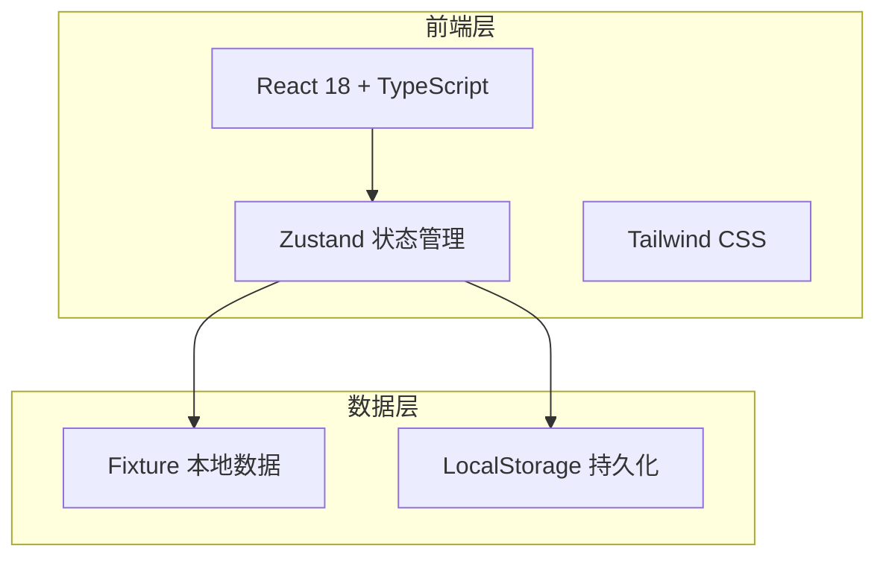
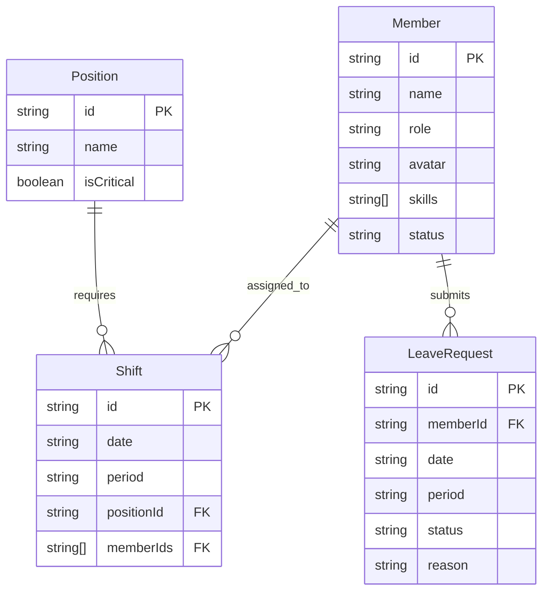

## 1. 架构设计



纯前端架构，无后端服务。所有数据通过 fixture 文件提供初始值，运行时状态由 Zustand 管理，持久化到 LocalStorage。

## 2. 技术说明

- 前端：React@18 + tailwindcss@3 + vite
- 初始化工具：vite-init
- 后端：无
- 数据库：无，使用 fixture 数据 + LocalStorage

## 3. 路由定义

| 路由 | 用途 |
|------|------|
| /login | 登录页，角色选择 |
| /schedule | 排班图主页（所有角色可见，操作权限不同） |
| /leave | 请假管理（组员提交、组长审批） |

## 4. API 定义

无后端 API。所有数据操作通过 Zustand store 完成。

## 5. 服务端架构图

不适用

## 6. 数据模型

### 6.1 数据模型定义



### 6.2 数据定义语言

```typescript
interface Position {
  id: string;
  name: string;
  isCritical: boolean;
}

interface Member {
  id: string;
  name: string;
  role: 'leader' | 'member' | 'manager';
  avatar: string;
  skills: string[];
  status: 'active' | 'on_leave';
}

interface Shift {
  id: string;
  date: string;
  period: 'morning' | 'afternoon' | 'night';
  positionId: string;
  memberIds: string[];
}

interface LeaveRequest {
  id: string;
  memberId: string;
  date: string;
  period: 'morning' | 'afternoon' | 'night' | 'all_day';
  status: 'pending' | 'approved' | 'rejected';
  reason: string;
}

interface Conflict {
  type: 'dual_coverage' | 'leave_overlap';
  shiftId: string;
  positionId: string;
  date: string;
  period: string;
  message: string;
}
```
